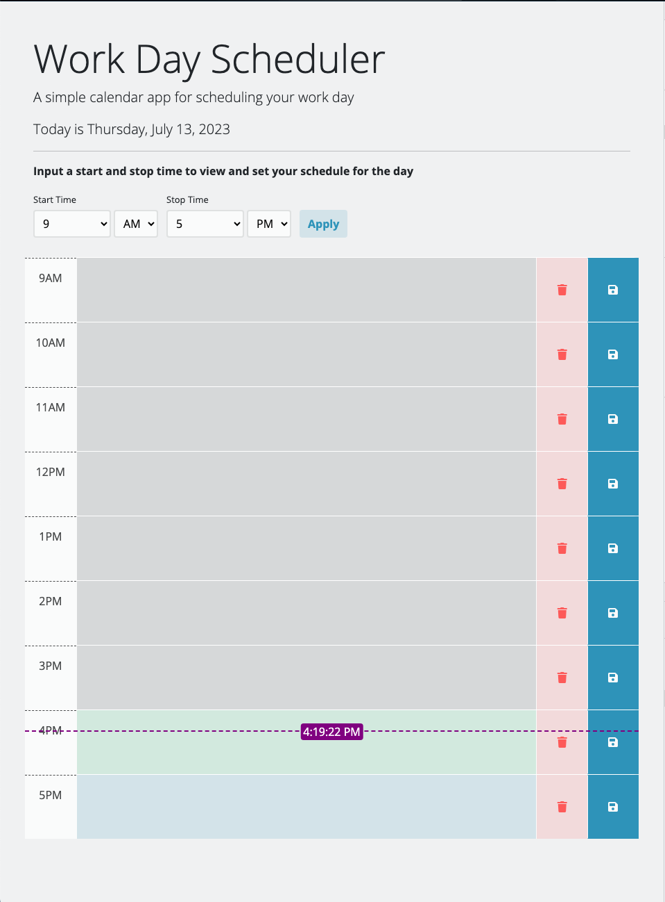

# Work Day Scheduler Starter Code

An application for storing the users daily agenda. User can input scheduled items into hour blocks and save. The items are stored in localStorage to a specific day.

## Installation

No packages to install

## Usage

I went a bit over the top with this one in order to get more practice with JS.  
You can set the pages default start and stop time with startHour and endHour Variables at the beginning of the core function.
Users can set their own start and stop times
Users can delete a rows information instead of having to clear the text and save.

## Contributing

Cloning the repo is welcome. Do not push new code into the repo without creating a pull request.

## License

No license on this repo

## Assets

Link to deployed application https://jsgunn22.github.io/day-planner/

